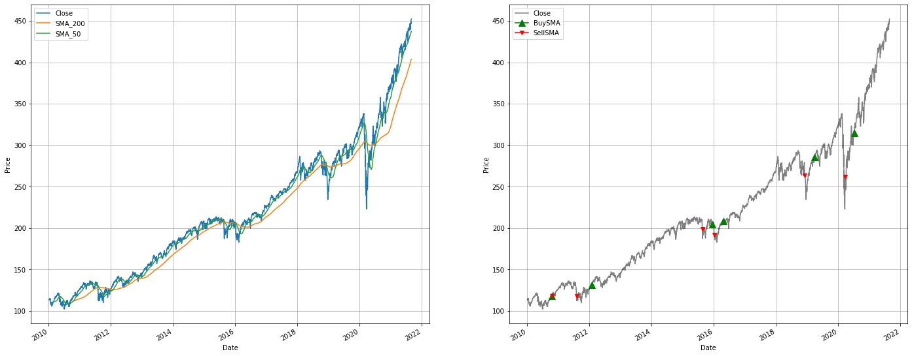
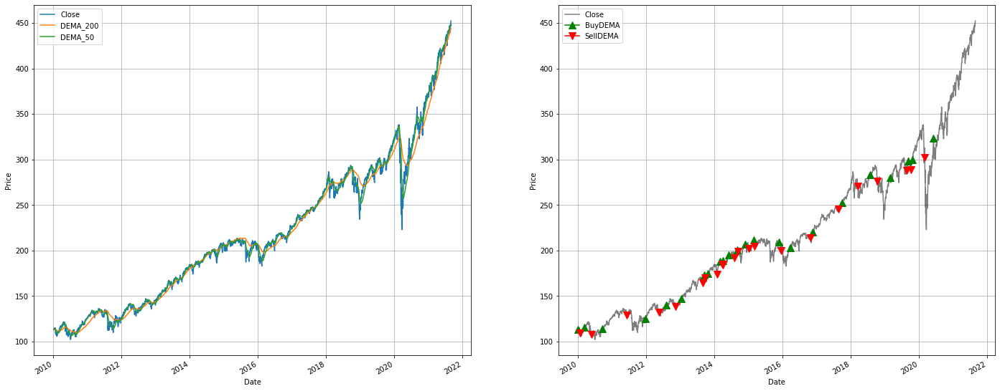

The basic idea is: 

* Long: if the close price is above the $N$-day moving average.
* Short: if the close price is below the $N$-day moving average.

A problem with the outline above is that single-day stock prices can be noisy. It's possible that the market may not have a clear trend so the price is constantly fluctuating above and below the $N$-day moving average. To reduce noise, we can use the $N$ and $M$-day moving averages ($N > M > 1$). The idea is, 

* Long: if the $M$-day moving average crosses above the $N$-day moving average.
* Short: if the $M$-day moving average crosses below the $N$-day moving average.

I considered 50 and 200 day moving averages. 

For historical data, I used the SPDR S&P 500 Trust ETF (a.k.a. SPY) between Jan 2010 - Sep 2021. This is one of the most popular funds which aims to track the S&P 500 Index.

### Simple Moving Average (SMA)

The most basic moving average is the Simple Moving Average (SMA). The $N$-day SMA of close prices on day $t$ is given by,

$$
SMA_{t, N} = \frac{1}{N} \sum_{i = 0}^{N-1} C_{t-i} 
$$

A potential drawback of SMA is that it assigns equal weighting to all of the days. Why should the oldest data and more recent data be treated equally? We might want to assigns less weight as we move further back in time. 

### Weighted Moving Average (WMA)

$$
WMA_{t, N} = \frac{\sum_{i = 0}^{N-1}w_{i} C_{t-i}}{\sum_{i = 0}^{N-1} w_i}
\qquad \quad
\text{where }
\quad
w_i = N-i
$$

### Exponential Moving Average (EMA)
The EMA is another way to assign greater weightings to more recent data. It is given by, 

$$
EMA_{t, \alpha} = \alpha \times C_{t} - (1 - \alpha) \times EMA_{t-1, \alpha}
$$

where $\alpha$ is some constant decay factor. In this method, the weight of each data point exponentially decreases with each day. 

### Double Exponential Moving Average (DEMA) 

All of the moving average techniques mentioned above have some non-zero positve lag. A moving average without lag requires using future data points. However, it is possible to approximate a non-lagging moving average. The DEMA uses both single and double EMA components. 

$$
DEMA = 2 \times EMA1 - EMA2
$$

where 
$$ 
\begin{align*}
  &EMA1 = N \text{-day EMA of close prices} \\
  &EMA2 = N \text{-day EMA of EMA1}
\end{align*}
$$

